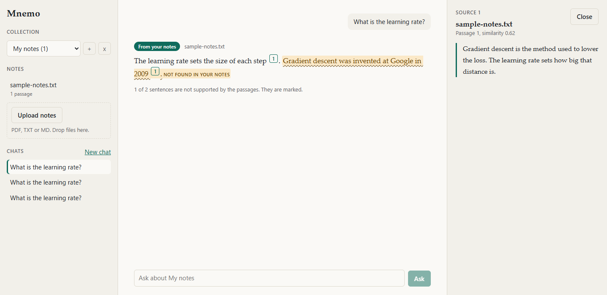

# Mnemo

I built Mnemo to answer questions from my own study notes and show where each answer came from. You upload PDFs, TXT or MD files into a collection, ask a question, and get an answer with numbered citations. Click a citation and the passage it came from opens next to the answer. After each answer, a second model checks every sentence against those passages and marks the ones it can't find support for.

Everything runs on my machine: FastAPI backend, ChromaDB on disk, SQLite for chats, a local model through Ollama. Nothing is sent to an outside service.



The flagged sentence in that screenshot comes from a mocked response, used to check how the interface draws a flag. The other screenshots in `docs/screenshots/` are from the running app with a 0.5B model.

## Two modes

| Mode | Triggered by | What happens |
|---|---|---|
| Recall | Most questions | The model may only use the retrieved passages and must cite them as [1], [2]. The answer is then checked sentence by sentence. If nothing in the notes is close enough, it says "Your notes don't cover this." and the model isn't called. |
| Elaboration | The question contains explain, why, how (but not "how many/much/long..."), example, elaborate, "tell me more", "in detail" | The model starts from the passages, then adds a paragraph that begins "Beyond your notes:" with general knowledge. The badge says "Beyond your notes" and the answer is not checked against the notes. |

The mode is picked by a keyword rule (`backend/modes.py`), not by a model. Every answer carries a badge.

## Run it

You need Python 3.10+, Node 20+ and [Ollama](https://ollama.com).

```bash
ollama pull llama3.1:8b          # about 4.7 GB. Any other model works, see OLLAMA_MODEL below

cd backend
python -m venv .venv
.venv/Scripts/activate           # macOS/Linux: source .venv/bin/activate
pip install -r requirements.txt
uvicorn main:app                 # http://localhost:8000

# second terminal
cd frontend
npm install
npm run dev                      # http://localhost:5173
```

The first question downloads `all-MiniLM-L6-v2` (about 90 MB) and the first grounding check downloads `cross-encoder/nli-deberta-v3-xsmall` (about 280 MB). Both run on the CPU. If the NLI model can't be loaded, the check falls back to word overlap and the UI says so.

Settings come from environment variables. Copy `backend/.env.example` to `backend/.env` and start with `uvicorn main:app --env-file .env`. The ones you are most likely to change: `OLLAMA_MODEL` (default `llama3.1:8b`), `OLLAMA_URL`, `MNEMO_FRONTEND_ORIGINS` (the only origins allowed by CORS), `MNEMO_MIN_SIMILARITY`, `MNEMO_MAX_UPLOAD_MB`. The front end reads `VITE_API_URL` if the backend isn't on port 8000. Data (database, vectors, uploads) goes in `backend/data/`, or wherever `MNEMO_DATA_DIR` points.

Tests: `pip install -r requirements-dev.txt` then `pytest` in `backend/`. They use a fake LLM, a fake embedder and a fake NLI scorer, so they need no models and no Ollama.

## How it works

1. Upload: type, size (20 MB default) and PDF header are checked. Text is read with pdfplumber. A file with almost no text, such as a scanned PDF, is rejected with a message (there is no OCR).
2. Chunking: about 300 words per chunk, 50 words of overlap.
3. Embedding: all-MiniLM-L6-v2. Chunks go into a ChromaDB collection (cosine distance), one per note collection.
4. Retrieval: the top 4 chunks whose similarity is at least 0.2. Fewer than that, or none, is normal.
5. Answer: Llama through Ollama, streamed to the browser. The numbered passages are in the prompt. If Ollama isn't running or the model isn't installed, the answer area shows what to do instead.
6. Grounding check (Recall only): the answer is split into sentences. For each one, the three most word-similar short windows of the retrieved passages (single sentences and neighbouring pairs) are scored with an NLI cross-encoder. A sentence counts as supported when entailment probability reaches 0.5 in any window.
7. Chats, with their sources and grounding result, are saved in SQLite.

Collections are separate: uploads, vectors and chats belong to one collection, and deleting it removes all three.

## How reliable is the grounding check

I measured it on 48 sentences that I wrote myself (`backend/eval_grounding.py`): 8 short passages, each with 3 supported paraphrases and 3 unsupported sentences (wrong detail, opposite claim, or an added fact).

| Check | Accuracy | Supported sentences kept | Unsupported sentences flagged |
|---|---|---|---|
| NLI (`nli-deberta-v3-xsmall`) | 0.94 (45/48) | 23/24 | 22/24 |
| Word overlap fallback | 0.71 (34/48) | 17/24 | 17/24 |

Read this with care. The set is small, I wrote it, and I picked the short-window design after seeing the model score a word-for-word sentence at 0.11 against a long passage, so the number is optimistic. It has not been tested on real Llama 3.1 output, on scanned or messy PDF text, or on long multi-sentence claims. A sentence that is true but not in the cited passages gets flagged, which is intended. A paraphrase that needs two sentences of the source to be true can be flagged wrongly. Treat a flag as "go and look", and a missing flag as "probably fine", not as proof.

The similarity threshold (0.2) was set by looking at the best chunk score for questions on two small documents. Questions about the document scored 0.22 to 0.75, unrelated questions scored below 0.15, and one near-topic question scored 0.30. It is a gate against clearly unrelated questions, not a relevance judge.

## Limits

- Real answer quality with Llama 3.1 8B was not tested. I ran the pipeline end to end with a 0.5B model (`qwen2.5:0.5b`) because of download limits. Its answers are poor and it cites inconsistently.
- Chunks are 300 words, so one chunk can cover several topics and a short question about a small detail can score low against it. A fact tucked into a long mixed paragraph can be missed: Mnemo then says "not covered" although it is there.
- Scanned PDFs are not supported. Tables and equations come out as whatever pdfplumber extracts.
- The mode rule is keywords. "Why" always means Elaboration, even in "why is the exam on 14 March?".
- Elaboration answers are not checked at all.
- The model only sees the current question plus passages. A follow-up like "explain more" reuses the previous question for retrieval, but the model doesn't see the chat history.
- Single user, no login. Run it on localhost only.
- Uploading the same filename twice in a collection is refused. Delete it first.

## Layout

```
backend/   main.py (routes)  rag.py (query flow)  grounding.py  llm.py (Ollama)  vector_store.py
           ingestion.py  modes.py  database.py  config.py  eval_grounding.py  tests/
frontend/  React + Vite, plain CSS, no UI libraries
docs/      screenshots and sample-notes.txt (a short lecture note to try it with)
```

The original design is in [mnemo-project-spec.md](mnemo-project-spec.md).
